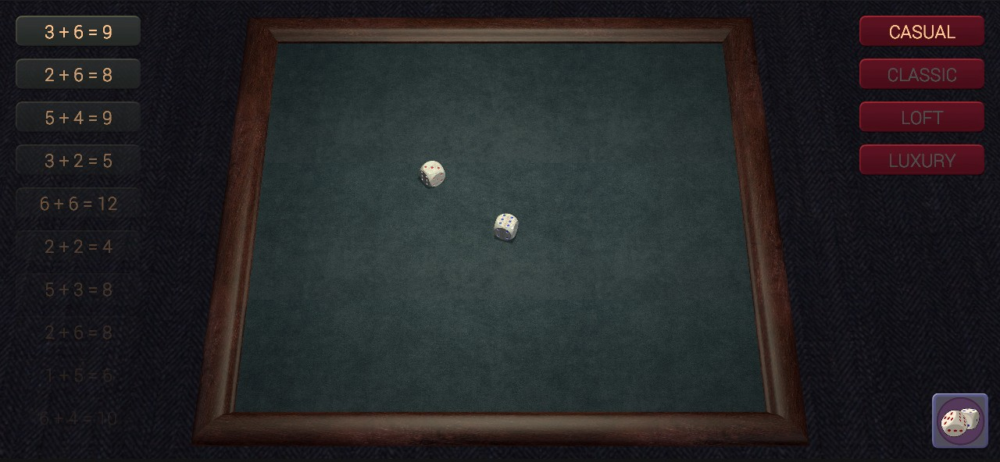
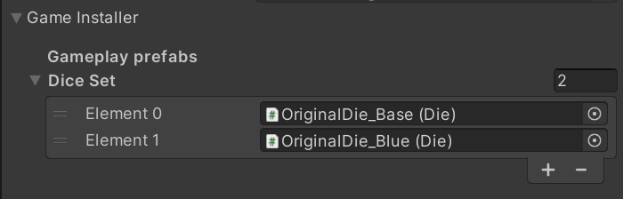
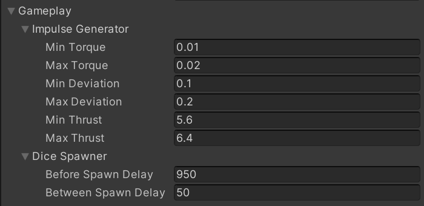
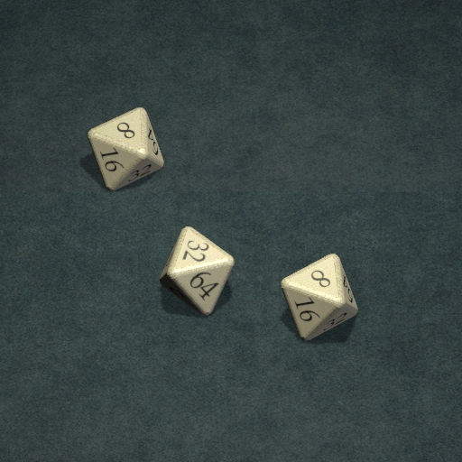
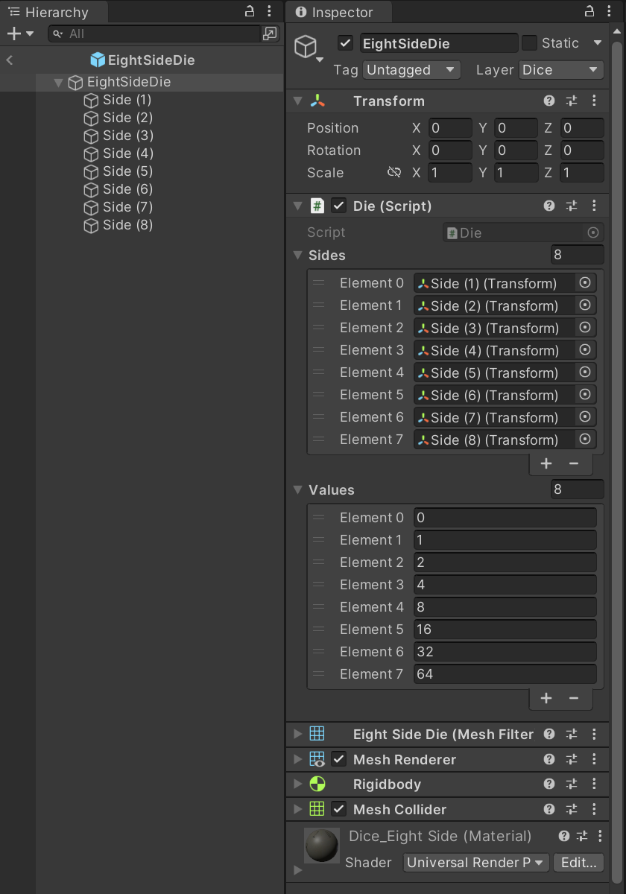

# Dice demo + Zenject

The project presented here is one example of how a physically plausible 
dice-rolling simulation can be implemented using the Unity game engine 
along with the Zenject framework. The assets for building the project 
were taken from the previously published 
[__Board game simulator__](https://store.steampowered.com/app/856670/Present_for_Manager/). 
In addition to the simulation of throwing dice, the ability to change and 
save the Theme of the game table has been added to the scene.
  

# Zenject framework

For the first acquaintance with third-party dependency injection tools 
in Unity, Zenject framework was chosen as the most common and demand. 
The documentation for this tool is very high quality, and the internet 
is full of information that helps to learn the basics quickly. Zenject 
allows building better project and scene architecture for those developers 
who understand its advantages over the traditional Unity dependency methods.

Since the presented project is just a sample of a scene, without states, 
other scenes and transitions between them, the real potential of Zenject 
was not revealed here. But the basic techniques of working with the 
dependency injection are used, and each program object somehow participates 
in the construction of code through the framework.

The following are the key Zenject mechanics used in the project and a brief 
description of the features and advantages:

## Constructor injection

The project uses only Constructor injection:

* Constructor injection forces the dependency to only be resolved once, at 
class creation, which is usually what you want. In most cases you don't want 
to expose a public property for your initial dependencies because this 
suggests that it's open to changing

*  Constructor injection guarantees no circular dependencies between classes, 
which is generally a bad thing to do. Zenject does allow circular dependencies 
when using other injections types however, such as method/field/property injection

* Finally, Constructor injection makes it clear what all the dependencies of a 
class are when another programmer is reading the code. They can simply look at 
the parameter list of the constructor. This is also good because it will be more obvious when a class has too many dependencies and should therefore be split up 
(since its constructor parameter list will start to seem long)

## Scriptable Object Installer

This is most commonly used to store game settings. This approach has the 
following advantages:

* Any changes you make to the properties of the installer will persist after you 
stop play mode. This can be very useful when tweaking runtime parameters. For 
other installer types as well as any MonoBehaviour's in your scene, any changes 
to the inspector properties at runtime will be undone when play mode is stopped

*  You can very easily swap out multiple instances of the same installer. For 
example, you might have an instance of GameSettingsInstaller called 
GameSettingsEasy, and another one called GameSettingsHard, etc

## Signals

In addition to being able to directly subscribe to signals on the signal bus 
(via SignalBus.Subscribe or SignalBus.GetStream) you can also directly bind a 
signal to a handling class inside an installer. This approach has advantages and 
disadvantages compared to directly subscribing in a handling class, so again comes 
down to personal preference. The project uses only Binding Signals with BindSignal.

## Factories

One of the things that often confuses people new to dependency injection is the 
question of how to create new objects dynamically, after the app/game has fully 
started up. For example, if you are writing a game in which you are spawning new 
enemies throughout the game, then you will want to construct new instances of the 
'Enemy' class, and you will want to ensure that this object gets injected with dependencies just like all the objects that are part of the initial object graph. 
The recommended way to achieve this is to use Factories.
  

# Straightforward architecture

If you prefer to explore this project implemented without Zenject framework, here 
is the original [__DiceDemo__](https://github.com/Shkurlatov/dice-demo-unity) 
project repository. The project structures are very similar, however object coupling 
is implemented using native Unity methods.
  

# Universal RP

Perhaps Scriptable Render Pipeline would be more suitable for such a 
project. But all textures and materials were transferred from an existing 
project, and were configured for Universal Render Pipeline. It was 
decided not to change anything and apply Universal Render Pipeline in 
the proposed scene, despite all the flaws in the initial implementation of 
materials and lighting.
  

# Usage

* Clone the repo as usual via cmd/terminal or in your favorite Git GUI 
software.
* Open the project folder in Unity Hub using 2021.3.14f1 or a more recent 
of 2021.3 editor versions.     
* Open scene "Project/Assets/Scenes/DiceDemoZenject.unity".
* Choose the Game view tab and set your preferred Aspect settings in the editor.
* Use the Play button in the Toolbar to see how the application plays.
  

# Dice

Since the main mechanics of this project is the dice roll simulation, let's dwell 
on this part in a little more detail. In this version of the project, all the 
parameters of the dice roll are hidden in the  GameSettingsInstaller. In order to 
view or change the parameters, you need to choose
"Project/Assets/Resources/Installers/GameSettingsInstaller.asset" settings file.

In the Gameplay prefabs section of the Game Installer settings, you can find the 
Dice Set list.

Here you can change the number of dice in the set and fill it with prefabs in the desired order. There must be at least one die in the set, otherwise the application will throw the corresponding exception at the launch.

Also, there are Impulse Generator and Dice Spawner properties in the Gameplay settings. 

 You can influence the throw parameters quite strongly by changing these properties.

In the world of board games, there are not only classic dice. Players use bizarre shaped dice with different numbers of faces and specific values. The project allows you to add new types of dice without changing a single line of code. After importing a custom die model and a collider to it into the project, it is enough to create the corresponding prefab, and you can use it in the Dice Set. To make it a little easier to understand the process of creating a custom die prefab, an additional eight-sided die has been added to the project.

On the example of it prefab, you can see the differences in object settings compared to the original die prefab. Please note that the number of die sides added to the Die class in the inspector must match the number of corresponding values.

Some dice shapes may require you to create your own physical material, such as with different friction settings. Also, for the desired behavior of the object during the simulation, you can separately adjust the parameters of the ridgidbody, such as mass and drag.
  

# License

    The MIT License (MIT)

    Copyright (c) 2023 Alexander Shkurlatov

    Permission is hereby granted, free of charge, to any person obtaining a copy
    of this software and associated documentation files (the "Software"), to deal
    in the Software without restriction, including without limitation the rights
    to use, copy, modify, merge, publish, distribute, sublicense, and/or sell
    copies of the Software, and to permit persons to whom the Software is
    furnished to do so, subject to the following conditions:

    The above copyright notice and this permission notice shall be included in all
    copies or substantial portions of the Software.

    THE SOFTWARE IS PROVIDED "AS IS", WITHOUT WARRANTY OF ANY KIND, EXPRESS OR
    IMPLIED, INCLUDING BUT NOT LIMITED TO THE WARRANTIES OF MERCHANTABILITY,
    FITNESS FOR A PARTICULAR PURPOSE AND NONINFRINGEMENT. IN NO EVENT SHALL THE
    AUTHORS OR COPYRIGHT HOLDERS BE LIABLE FOR ANY CLAIM, DAMAGES OR OTHER
    LIABILITY, WHETHER IN AN ACTION OF CONTRACT, TORT OR OTHERWISE, ARISING FROM,
    OUT OF OR IN CONNECTION WITH THE SOFTWARE OR THE USE OR OTHER DEALINGS IN THE
    SOFTWARE.
    